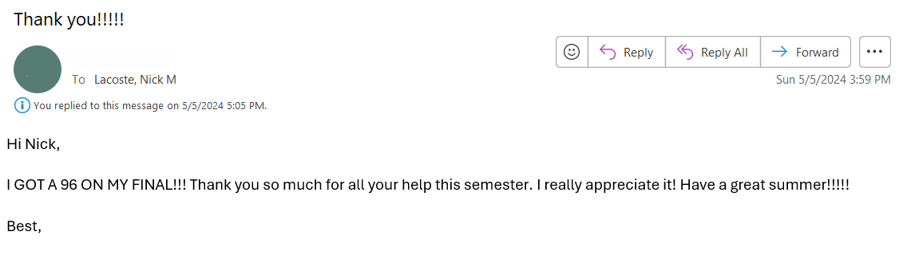
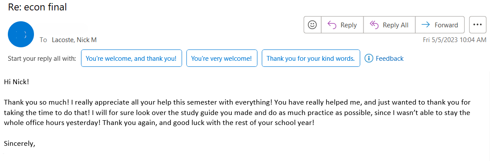
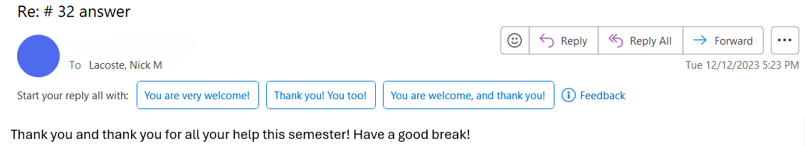

**Here is an overview of all relevant teaching experience. Here, you'll see the following:**

1. Courses TA'd for and taught, along with any guest lectures
2. Teaching reviews
3. Teaching certifications
4. Sample assignment 
4. Teaching philosophy statement
5. DEI statement

## Courses Taught

**Teaching Assistant**

* Development Economics (Fall 2024)
* Economics of Big Data (Fall 2023, Spring 2024)
* Introductory Microeconomics (Fall 2023, Spring 2024)
* Introductory Macroeconomics (Fall 2024, Fall 2022, Spring 2023)
* Intermediate Microeconomic Theory (Fall 2022)

**Guest Lectures**

* "Machine Learning for Economists" (Empirical Methods for Political Economy -- Fall 2024)
* "Microfinance" (Development Economics -- Spring 2025)

## Teaching Reviews

**Microeconomics Fall 2023 TA Survey**

Download this [link](econ_1010_fall23_survey.pdf) to view some reviews from Microeconomics Fall 2023.

All three students who filled out the TA review survey replied "Strongly Agree" to all teaching quality related questions (it was optional, there was no reward for filling it out, and the course was unfortunately taken down shortly after I administered it which limited the number of respondents)

Some satisfied students!

## Teaching Certifications/Coursework

**Certificate in Pedagical Practice (expected Spring 2025)**

* This is administered by the Tulane University Center for Engaged Learning and Teaching (CELT). It is obtained by completion of a 3-course sequence in graduate pedagogy:

1. CELT 7010 | The Essentials of Teaching & Learning

"This course is one of the series of 3 1-credit hour courses with this course being the first of the series. The nature of this course will comprise the theoretical underpinnings in effective teaching and learning. This course provides the framework upon which excellence in teaching is built. We will approach to better facilitate student learning and improve teaching practices. Students will investigate the science of learning, identify strategies of effective teaching practices, discuss ways to ensure inclusive and diverse classroom environments and the pedagogy or service learning. The course will culminate with the writing of a Teaching Philosophy and creating a Teaching E-Porfolio."

2. CELT 7020 | Practical Course Design & Teaching Skills

"This course building on the theories presented in CELT 7010, will focus on the practical applications of course design, classroom management techniques, the appropriate inclusion of technology and the development of learning-based assessments."

3. CELT 7030 | Teaching Practicum

"This course is designed to provide students feedback on actual teaching opportunities. Some students maybe the faculty of record for a course in their department, others will be a guest lecturer or give lectures to peers."

**As of 12/11/24, I have completed the first 2 courses in this sequence.**

